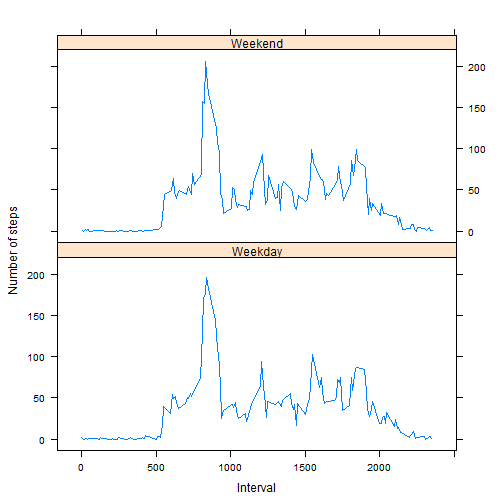

# Reproducible Research Assignment 1

This is an R Markdown document prepared for Re-Producible Research Assignment1. The R Code below loads the activity.csv file and assigns the data into the dataset as dataSet. In the next step ignore the missing values in the dataset.

## Loading and preprocessing the data

This section of R code loads the data into dataSet then presents first 20 records as data sample.


```r
dataSet <- read.csv("activity.csv")
head(dataSet, 20)
```

```
##    steps       date interval
## 1     NA 2012-10-01        0
## 2     NA 2012-10-01        5
## 3     NA 2012-10-01       10
## 4     NA 2012-10-01       15
## 5     NA 2012-10-01       20
## 6     NA 2012-10-01       25
## 7     NA 2012-10-01       30
## 8     NA 2012-10-01       35
## 9     NA 2012-10-01       40
## 10    NA 2012-10-01       45
## 11    NA 2012-10-01       50
## 12    NA 2012-10-01       55
## 13    NA 2012-10-01      100
## 14    NA 2012-10-01      105
## 15    NA 2012-10-01      110
## 16    NA 2012-10-01      115
## 17    NA 2012-10-01      120
## 18    NA 2012-10-01      125
## 19    NA 2012-10-01      130
## 20    NA 2012-10-01      135
```


## Calculate mean total number of steps taken per day

1.  The following code Calculates the total number of steps taken per day ignoring the missing values in the dataset. A histogram is made for the total number of steps taken each day.


```r
library(ggplot2)
meanStepsPerDay <- aggregate(steps ~ date, dataSet, sum)
ggplot(meanStepsPerDay, aes(x = steps)) + geom_histogram(colour = "white") + 
    ylab("Frequency") + xlab("Steps Per Day") + ggtitle("Total Number of Steps taken per Day\n")
```

```
## stat_bin: binwidth defaulted to range/30. Use 'binwidth = x' to adjust this.
```

 

2.  The mean and median of total number of steps taken per day calculated and reported as follows.


```r
attach(dataSet)
meanValue <- mean(meanStepsPerDay$steps)
medianValue <- median(meanStepsPerDay$steps)
detach(dataSet)

meanValue
```

```
## [1] 10766
```

```r
medianValue
```

```
## [1] 10765
```


## Determine the average daily activity pattern

1.  A time series plot (i.e.  type = "l" ) of the 5-minute interval (x-axis) and the average number of steps taken, averaged across all days (y-axis) made as follows:


```r
timeSeries <- tapply(dataSet$steps, dataSet$interval, mean, na.rm = TRUE)
plot(row.names(timeSeries), timeSeries, type = "l", xlab = " 5-minute interval", 
    ylab = "Average across all Days", main = "Average number of steps taken")
```

 


2.  The following code used to determine Which 5-minute interval on average across all the days in the dataset contains the maximum number of steps.


```r
maxStepsInterval <- names(which.max(timeSeries))
maxStepsInterval
```

```
## [1] "835"
```


## Imputing missing values

1.  The total number of missing values in the dataset (i.e. the total number of rows with  NA s) are calculated and reported as follows:


```r
library(sqldf)
```

```
## Loading required package: gsubfn
## Loading required package: proto
## Loading required package: RSQLite
## Loading required package: DBI
## Loading required package: RSQLite.extfuns
```

```r
numOfMissingValues <- sqldf("select count(*) numOfMissingValues from dataSet where steps is NULL")
```

```
## Loading required package: tcltk
```

```r

numOfMissingValues
```

```
##   numOfMissingValues
## 1               2304
```


2.  Devise a strategy for filling in all of the missing values in the dataset. The strategy does not need to be sophisticated. For example, you could use the mean/median for that day, or the mean for that 5-minute interval, etc.

     Startegy - Find the mean of steps form the original dataset where steps is not NA group by interval. i.e. mean steps for an interval  where steps is NOT NA. Now check the original dataset, if any steps value is NA in the original dataset for an interval then replace it with the mean steps for the same interval. Show some sample data after implementing the startegy. 

3. A new dataset that is equal to the original dataset but with the missing data filled in created as follows. Also first 20 records of new dataset presented as sample outcome of new set of dataset.


```r
library(sqldf)
meanSteps <- sqldf("select avg(steps) as meanval, interval \n                      from dataSet \n                     where steps is NOT NULL group by interval")

fdataSet <- sqldf(" select ifnull(ds.steps,ms.meanval) as steps,ds.date, ds.interval \n                       from  dataSet ds, meanSteps ms\n                      where  ds.interval=ms.interval")

head(fdataSet, 20)
```

```
##    steps       date interval
## 1      1 2012-10-01        0
## 2      0 2012-10-01        5
## 3      0 2012-10-01       10
## 4      0 2012-10-01       15
## 5      0 2012-10-01       20
## 6      2 2012-10-01       25
## 7      0 2012-10-01       30
## 8      0 2012-10-01       35
## 9      0 2012-10-01       40
## 10     1 2012-10-01       45
## 11     0 2012-10-01       50
## 12     0 2012-10-01       55
## 13     0 2012-10-01      100
## 14     0 2012-10-01      105
## 15     0 2012-10-01      110
## 16     0 2012-10-01      115
## 17     0 2012-10-01      120
## 18     1 2012-10-01      125
## 19     1 2012-10-01      130
## 20     0 2012-10-01      135
```


4.  This step makes a histogram of the total number of steps taken each day and then calculates and reports the mean and median total number of steps taken per day. 


```r
library(ggplot2)
fmeanStepsPerDay <- aggregate(steps ~ date, fdataSet, sum)
ggplot(fmeanStepsPerDay, aes(x = steps)) + geom_histogram(colour = "white") + 
    ylab("Frequency") + xlab("Steps Per Day") + ggtitle("Total Number of Steps taken per Day\n")
```

```
## stat_bin: binwidth defaulted to range/30. Use 'binwidth = x' to adjust this.
```

 

The following code calculates and reports the mean and median total number of steps taken per day

```r
attach(fdataSet)
meanVal <- mean(fmeanStepsPerDay$steps)
medianVal <- median(fmeanStepsPerDay$steps)
detach(fdataSet)

meanVal
```

```
## [1] 10750
```

```r
medianVal
```

```
## [1] 10641
```


Do these values differ from the estimates from the first part of the assignment? The response to this question is - Yes, it is different from the first part of the assignment.

What is the impact of imputing missing data on the estimates of the total daily number of steps?

Refer to the graph below which presents comperative impact before and after imputing the missing data. It is observed that the after imputting missing data, the mean and median value decreased compared to the original values i.e prior to imputting the missing data.


```r
library(ggplot2)
meanStepsPerDay <- aggregate(steps ~ date, dataSet, sum)
p1 <- ggplot(meanStepsPerDay, aes(x = steps)) + geom_histogram(colour = "white") + 
    ylab("Frequency") + xlab("Steps Per Day") + ggtitle("Number of Steps taken per Day\n Prior to imputing missing values")

fmeanStepsPerDay <- aggregate(steps ~ date, fdataSet, sum)
p2 <- ggplot(fmeanStepsPerDay, aes(x = steps)) + geom_histogram(colour = "white") + 
    ylab("Frequency") + xlab("Steps Per Day") + ggtitle("Number of Steps taken per Day\n After imputing missing values")

# Below code is used in place of install.packages('gridExtra') to avoid
# install error.
repos = "http://cran.rstudio.com/"
if (!require("yaml")) {
    install.packages("yaml", repos = "http://cran.rstudio.com/")
    library("yaml")
}
```

```
## Loading required package: yaml
```

```r
## The below code is used to draw the graph side by side for comperision.
library("gridExtra")
```

```
## Loading required package: grid
```

```r
grid.newpage()
pushViewport(viewport(layout = grid.layout(2, 1)))
# Define grid layout to locate plots and print each graph
pushViewport(viewport(layout = grid.layout(1, 2)))
print(p1, vp = viewport(layout.pos.row = 1, layout.pos.col = 1))
```

```
## stat_bin: binwidth defaulted to range/30. Use 'binwidth = x' to adjust this.
```

```r
print(p2, vp = viewport(layout.pos.row = 1, layout.pos.col = 2))
```

```
## stat_bin: binwidth defaulted to range/30. Use 'binwidth = x' to adjust this.
```

 


## Activity patterns between weekdays and weekends

1. The following code creates a new factor variable in the dataset with two levels -- "weekday" and "weekend" indicating whether a given date is a weekday or weekend day


```r
attach(fdataSet)
# create a vector of weekdays
weekdays1 <- c("Monday", "Tuesday", "Wednesday", "Thursday", "Friday")
# Use `%in%` and `weekdays` to create a logical vector convert to `factor`
# and specify the `levels/labels`
fdataSet$weekdays <- factor((weekdays(as.Date(fdataSet$date)) %in% weekdays1), 
    levels = c(FALSE, TRUE), labels = c("weekend", "weekday"))
detach(fdataSet)
```


2.  The following code makes a panel plot containing a time series plot (i.e.  type = "l" ) of the 5-minute interval (x-axis) and the average number of steps taken, averaged across all weekday days or weekend days (y-axis).  


```r
library(lattice)
stepsPerInterval <- sqldf("select avg(steps) as avgSteps, interval from fdataSet group by interval")
xyplot(stepsPerInterval$avgSteps ~ stepsPerInterval$interval | c("Weekday", 
    "Weekend"), type = "l", layout = c(1, 2), xlab = "Interval", ylab = "Number of steps")
```

 

